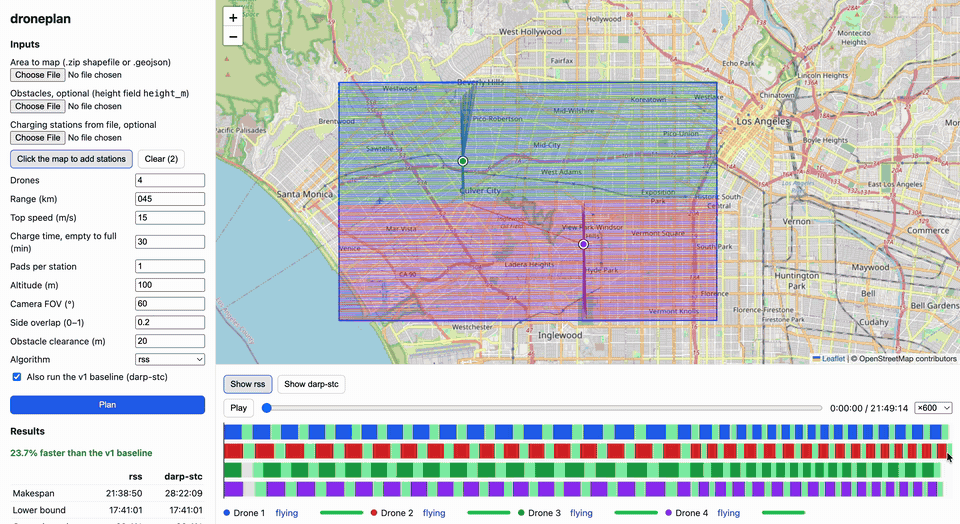

# Drone Route Planning

Plans the fastest way for a fleet of battery-limited drones to map an area, recharging at automatic stations and flying around obstacles. Built from the ISRO problem statement (Smart India Hackathon 2020).

This is a from-scratch rebuild of our team's SIH 2020 project, [CoveragePathPlanning](https://github.com/18alantom/CoveragePathPlanning) (v1 throughout this README), which it benchmarks against.



## The problem
> Develop an application for automatically planning a route (for shortest time to cover area) and schedule of drones for mapping a given area. Inputs: (1) map of area (shapefile), (2) number of drones, (3) range in km based on battery life, (4) top speed, (5) locations of automatic charging stations. The software must visualize a simulated animation of the plan.

The objective is **makespan**: the time until the last drone lands with every mappable cell photographed. Every flight (a *sortie*) starts and ends at a charging station and stays within the battery's range. A station charges one drone at a time, so the others queue on the ground. An optional obstacle layer adds buildings or terrain: anything taller than the flight altitude must be flown around, and is reported as unmappable.

## What's implemented
**Route → Split → Schedule (RSS)**, a route-first, cluster-second pipeline (Beasley 1983; Prins 2004):
1. **Frame and grid.** Project to local UTM metres and rotate so lanes run along the area's minimum-width direction (the fewest lanes, so the fewest U-turns). Rasterize at the camera footprint.
2. **Router.** A visibility graph over the corners of inflated obstacles gives exact shortest paths. It is the single source of every distance, for every algorithm.
3. **Route.** One coverage tour of the whole area: lanes ordered by turn-aware nearest-neighbour, then 2-opt (Numba).
4. **Split.** A dynamic program cuts the tour into battery-feasible sorties at the cheapest points. It is optimal for a fixed tour, checked against brute force.
5. **Schedule.** Longest-first list scheduling. Each drone lands at the station where its charge will finish soonest, counting the queue, and can reposition between stations. A search over the sortie length picks the lowest makespan. `rss` also tries the unrotated grid and a greedy split, and keeps the best plan.
6. **Validate.** An independent checker verifies every plan from every algorithm: coverage, range, station endpoints, no path through an obstacle, timing, charging, and pad capacity.

**Baselines.** The original 2020 approach (**v1**) was area-first: DARP splits the area evenly between drones, STC builds a spanning-tree path per drone, and refuelling is added afterwards. `darp-stc` re-implements it with its bugs fixed. `darp-boustrophedon` swaps in our lane tour. Both share the router, flight model and validator, so the comparison is like for like.

**Delivery.** A Python library and CLI (`droneplan`), a FastAPI service, and a React + Leaflet app that replays the plan: each drone's position, state and battery, a schedule Gantt chart, and metrics next to the v1 baseline. There is also GeoJSON export with per-vertex timestamps, a benchmark runner, and CI.

## Quick start
```bash
python3.12 -m venv .venv && source .venv/bin/activate && pip install -e ".[dev]"
droneplan area.shp --stations stations.geojson --obstacles buildings.shp \
  --drones 4 --range-km 10 --speed 15 --out plan.geojson
```

## Run the app
```bash
docker compose up --build      # then open http://localhost:8000
```
Or for development: `pip install -e ".[dev,api]" && uvicorn droneplan.api.app:app --reload`, and in another terminal `cd web && pnpm install && pnpm dev` (http://localhost:5173).

Upload `examples/area.geojson`, `examples/obstacles.geojson` and `examples/stations.geojson` (stations can also be added on the map), set Drones 4, Range 12 km and Speed 15 m/s, and click **Plan**. The replay shows each drone's position, state (flying, queued, charging) and battery, a schedule Gantt chart, and the metrics next to the v1 baseline.

Every part of the area must be within half the usable range (range × 0.9) of some station. Otherwise planning stops with an "out of range" error, so spread stations across large areas.

## Assumptions (all configurable)
| Parameter | Default |
|---|---|
| Altitude, camera FOV, side overlap | 100 m, 60°, 20%, giving a 92.4 m swath |
| Charging | 30 min from empty to full, linear in the energy used; 1 pad per station |
| Battery reserve | 10% of the range is never used |
| Turns | A full reversal costs `v/a` seconds (a = 2 m/s²); flying straight costs nothing |
| Obstacle clearance | 20 m horizontal buffer |

Wind, drone-to-drone collisions (drones are assumed separated by altitude) and climbing over obstacles are out of scope.

## Metrics
| Metric | Meaning |
|---|---|
| Makespan | Time until the last drone lands with the area covered (the objective) |
| Lower bound, gap | A provable minimum makespan, and how far above it the plan is |
| Distance, flights, turns | Total flown distance, number of sorties, and heading changes over 1° |
| Coverage, redundancy | Share of mappable cells covered, and extra visits per cell |
| Queue wait | Total time drones sit landed waiting for a free charging pad |
| Utilization | Flying time ÷ (drones × makespan) |
| Unmappable | Area inside obstacles, reported rather than silently dropped |
| Solve time | The whole planning call, including projection and router build |

## Results (30 seeded synthetic areas, each with and without obstacles)
The synthetic areas are irregular 8–15-sided polygons, some with holes, with 1–4 stations, 2–8 drones and ranges of 7.6–29.6 km. Each obstacle variant uses the same area, stations and fleet as its twin. All 360 plans pass validation.

### Without obstacles

| algorithm          |   makespan_min |   vs_v1_pct |   gap_to_lb_pct |   turns |   solve_s |   wins |   valid_pct |
|:-------------------|---------------:|------------:|----------------:|--------:|----------:|-------:|------------:|
| rss                |         256.3  |      -41.93 |          101.68 |  134.13 |      0.64 |     30 |         100 |
| rss-full-budget    |         262.2  |      -39.85 |          110.44 |  138.67 |      0.06 |      0 |         100 |
| rss-fixed-angle    |         271.44 |      -37.34 |          125.05 |  167.33 |      0.33 |      0 |         100 |
| rss-greedy-split   |         279.01 |      -37.04 |          117.17 |  133.27 |      0.38 |      0 |         100 |
| darp-stc           |         416.43 |        0    |          315.46 |  598.63 |      0.15 |      0 |         100 |
| darp-boustrophedon |         421.94 |       -1.09 |          296.52 |  301.43 |      0.13 |      0 |         100 |

### With obstacles

| algorithm          |   makespan_min |   vs_v1_pct |   gap_to_lb_pct |   turns |   solve_s |   wins |   valid_pct |
|:-------------------|---------------:|------------:|----------------:|--------:|----------:|-------:|------------:|
| rss                |         255.55 |      -40.79 |          110.2  |  144.43 |      1.25 |     30 |         100 |
| rss-full-budget    |         260.38 |      -39.33 |          116.75 |  148.17 |      0.29 |      0 |         100 |
| rss-fixed-angle    |         271.02 |      -36.85 |          127.38 |  183.4  |      0.67 |      0 |         100 |
| rss-greedy-split   |         278.57 |      -35.73 |          128.06 |  149.9  |      0.8  |      0 |         100 |
| darp-stc           |         412.97 |        0    |          304.45 |  615.53 |      0.22 |      0 |         100 |
| darp-boustrophedon |         418.34 |        1.51 |          310.25 |  316.5  |      0.18 |      0 |         100 |

`vs_v1_pct`: mean change in makespan vs the v1 pipeline (DARP + STC + greedy refuel). `gap_to_lb_pct`: how far above a provable lower bound. `solve_s`: the whole `plan_area` call, including projection and router build. `rss` plans at both the min-width sweep angle and 0°, with both the DP and greedy split, and keeps the lowest makespan; each `rss-*` ablation removes one of those choices, so none can beat `rss`.

**What the numbers say.**
- `rss` cuts makespan by about 41% against v1, and is never slower than any other algorithm on any of the 60 instances.
- The **ablations** show what each idea is worth, in percentage points of `vs_v1_pct` lost without obstacles / with them: the optimal split 4.9 / 5.1, the sweep angle 4.6 / 3.9, and the sortie-length search 2.1 / 1.5.
- Even the weakest ablation is still about 36% faster than v1, so most of the gain comes from the route-first structure itself.
- `darp-boustrophedon` has half the turns of `darp-stc` but is no faster. The win comes from scheduling by time rather than splitting by area, not from path shape.

The baselines (`darp-stc`, `darp-boustrophedon`) are re-implementations of v1 with its bugs fixed, and they share the same router and validator, so the comparison is fair. The comparison is on makespan, not optimality. The lower bound charges each mappable cell min(s, 2d) of flying, where s is the cell size and d the routed distance from the cell to its nearest station, plus pro-rata recharging of the energy beyond the fleet's full batteries; it ignores turns and most of the flying to and from stations, so it stays loose: `rss` averages 101.68% above it without obstacles and 110.2% with them, `darp-stc` 315.46% and 304.45%. A large `gap_to_lb_pct` therefore does not mean a plan is far from optimal. The bound is computed on each algorithm's own grid, so `gap_to_lb_pct` for the fixed-angle algorithms uses a different bound.

**Limits:** the visibility graph is built over all pairs of obstacle vertices, so its cost grows with their square (about 4 s at ~800 nodes, ~64 s at ~1800); very large building layers need simplifying first.

## Development
`pytest` · `ruff check .` · `mypy src tests benchmarks` · `python -m benchmarks.run --seeds 30` · `cd web && pnpm test && pnpm build`
